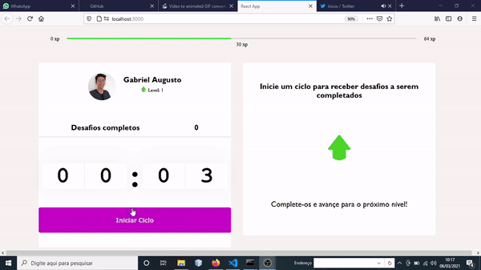

# Aplicação que nos lembra de fazer pequenos exercícios musculares ou alongamentos a cada 25 minutos.
Deve-se cumprir os desafios para avançar de nível.

Tecnologias aprendidas, usadas e aperfeiçoadas:

* React
* Notificações
* Context API
* Hooks do React

